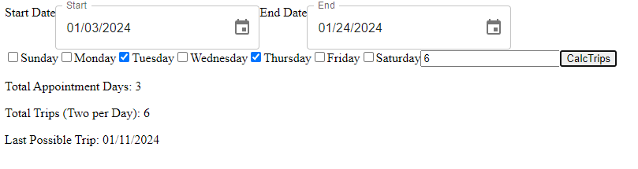

# Trip Calculator
  ## Description
  This was a small helper program to simply calculate how many trips (one day is two trips for back and forth travel) between two dates with set weekly appointments.
  ## Contributing
  Currently this is a solo project and will be updated as more features are requested.

  ## Questions
  Please contact me using my github page at https://www.github.com/kylatae or email at kylatae@gmail.com

  ## Preview Page

Repo Link:[https://github.com/kylatae/trip_calc](https://github.com/kylatae/trip_calc)
Deployed App: [https://moonlit-tiramisu-f74b59.netlify.app/](https://moonlit-tiramisu-f74b59.netlify.app/)
